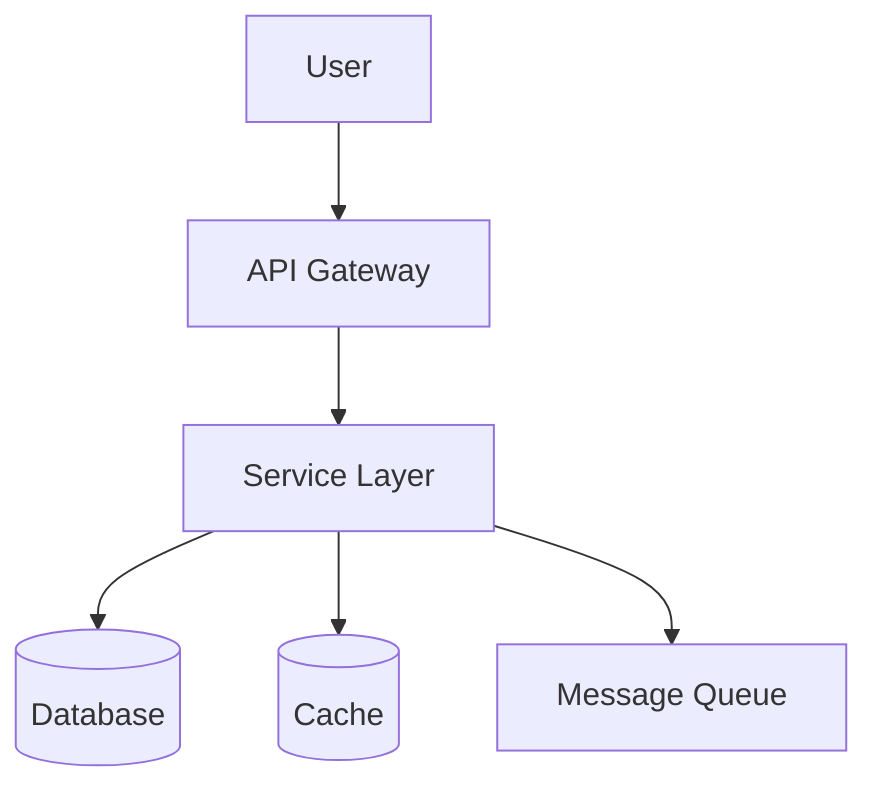
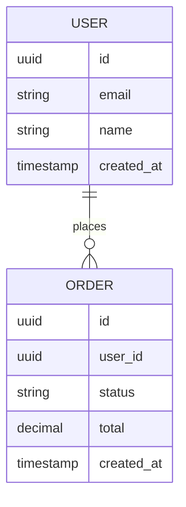
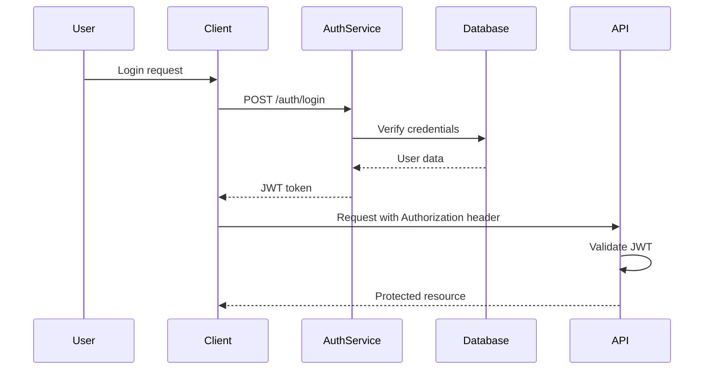
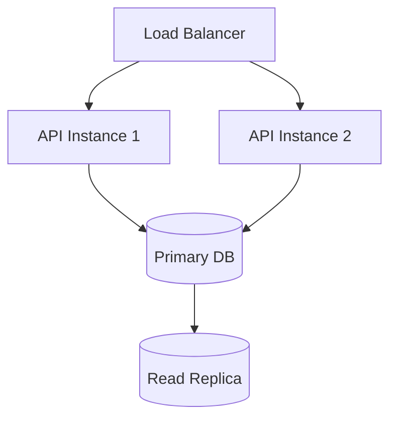
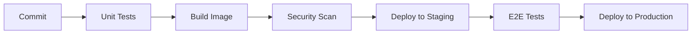

# Design Document

## 1. Architecture Overview

### 1.1 System Context
[High-level description of where this system fits]

### 1.2 Component Diagram



### 1.3 Component List

| Component | Responsibility | Technology |
|-----------|----------------|------------|
| [Name] | [What it does] | [Tech choice] |

---

## 2. Technology Stack

| Layer | Technology | Version | Rationale |
|-------|-----------|---------|-----------|
| Language | [e.g., Python] | [3.12] | [Why] |
| Framework | [e.g., FastAPI] | [0.100+] | [Why] |
| Database | [e.g., PostgreSQL] | [15] | [Why] |
| Cache | [e.g., Redis] | [7] | [Why] |
| Message Queue | [e.g., RabbitMQ] | [3.12] | [Why] |
| Container | [e.g., Docker] | [24] | [Why] |
| Orchestration | [e.g., Kubernetes] | [1.28] | [Why] |

---

## 3. Data Model

### 3.1 Entity Relationship Diagram



### 3.2 Schema Definitions

```sql
-- Table: users
CREATE TABLE users (
    id UUID PRIMARY KEY DEFAULT gen_random_uuid(),
    email VARCHAR(255) UNIQUE NOT NULL,
    name VARCHAR(255) NOT NULL,
    created_at TIMESTAMP DEFAULT NOW(),
    updated_at TIMESTAMP DEFAULT NOW()
);

-- Table: orders
CREATE TABLE orders (
    id UUID PRIMARY KEY DEFAULT gen_random_uuid(),
    user_id UUID REFERENCES users(id) ON DELETE CASCADE,
    status VARCHAR(50) NOT NULL DEFAULT 'pending',
    total DECIMAL(10, 2) NOT NULL DEFAULT 0.00,
    created_at TIMESTAMP DEFAULT NOW(),
    updated_at TIMESTAMP DEFAULT NOW()
);

-- Indexes
CREATE INDEX idx_orders_user_id ON orders(user_id);
CREATE INDEX idx_orders_status ON orders(status);
```

### 3.3 Migration Strategy
- Migration tool: [e.g., Alembic, Flyway]
- Naming: `YYYYMMDD_HHMMSS_description.sql`
- Rollback: Each migration has corresponding rollback

---

## 4. API Specification

### 4.1 Base URL
- Development: `http://localhost:8000`
- Staging: `https://api-staging.example.com`
- Production: `https://api.example.com`

### 4.2 Authentication
- Type: [JWT / OAuth 2.0 / API Key]
- Header: `Authorization: Bearer <token>`

### 4.3 OpenAPI Specification

```yaml
openapi: 3.0.0
info:
  title: [API Name]
  version: 1.0.0
  description: [Description]

servers:
  - url: https://api.example.com/v1
    description: Production

paths:
  /resource:
    get:
      summary: List resources
      parameters:
        - name: page
          in: query
          schema:
            type: integer
            default: 1
        - name: limit
          in: query
          schema:
            type: integer
            default: 20
      responses:
        '200':
          description: Success
          content:
            application/json:
              schema:
                $ref: '#/components/schemas/ResourceList'
    
    post:
      summary: Create resource
      requestBody:
        required: true
        content:
          application/json:
            schema:
              $ref: '#/components/schemas/ResourceCreate'
      responses:
        '201':
          description: Created
        '400':
          description: Bad Request

components:
  schemas:
    Resource:
      type: object
      properties:
        id:
          type: string
          format: uuid
        name:
          type: string
        created_at:
          type: string
          format: date-time
    
    ResourceList:
      type: object
      properties:
        items:
          type: array
          items:
            $ref: '#/components/schemas/Resource'
        total:
          type: integer
        page:
          type: integer
```

### 4.4 Error Response Format

```json
{
  "error": {
    "code": "VALIDATION_ERROR",
    "message": "Request validation failed",
    "details": [
      {
        "field": "email",
        "message": "Invalid email format"
      }
    ]
  }
}
```

---

## 5. Component Details

### 5.1 [Component Name]

**Purpose**: [What it does]

**Interface**:
- Inputs: [What it receives]
- Outputs: [What it produces]

**Dependencies**:
- [Dependency 1]
- [Dependency 2]

**Error Handling**:
- [Strategy for errors]

---

## 6. Security Architecture

### 6.1 Authentication Flow



### 6.2 Authorization Model
- Type: [RBAC / ABAC]
- Roles: [List roles]
- Permissions: [List permissions]

### 6.3 Data Protection
- Encryption at rest: [Method]
- Encryption in transit: [TLS version]
- Secret management: [Tool]

---

## 7. Deployment Architecture

### 7.1 Infrastructure Diagram



### 7.2 Environment Configuration

| Environment | URL | Database | Scaling |
|-------------|-----|----------|---------|
| Development | localhost | SQLite | 1 instance |
| Staging | staging.example.com | RDS staging | 2 instances |
| Production | api.example.com | RDS production | Auto 2-10 |

### 7.3 CI/CD Pipeline



---

## 8. Monitoring & Observability

### 8.1 Metrics

| Metric | Type | Alert Threshold |
|--------|------|-----------------|
| Request rate | Counter | - |
| Error rate | Gauge | > 1% |
| Latency p95 | Histogram | > 500ms |
| CPU usage | Gauge | > 80% |
| Memory usage | Gauge | > 85% |

### 8.2 Logging
- Level: INFO (production), DEBUG (development)
- Format: JSON
- Fields: timestamp, level, message, trace_id, user_id

### 8.3 Tracing
- Tool: [Jaeger / Zipkin / AWS X-Ray]
- Sampling: 10% production, 100% staging

---

## 9. Risk Mitigation

| Risk | Likelihood | Impact | Mitigation |
|------|-----------|--------|------------|
| [Risk description] | High/Med/Low | High/Med/Low | [Strategy] |

---

## 10. Implementation Phases

| Phase | Scope | Dependencies | Effort | Deliverable |
|-------|-------|--------------|--------|-------------|
| 1 | [What] | [Prereqs] | [Time] | [Output] |
| 2 | [What] | [Prereqs] | [Time] | [Output] |
| 3 | [What] | [Prereqs] | [Time] | [Output] |

---

## 11. Open Questions

| # | Question | Owner | Due Date | Blocking |
|---|----------|-------|----------|----------|
| 1 | [Question] | [Name] | [Date] | Yes/No |

---

## 12. Appendix

### 12.1 ADRs
- [ADR-001: Technology choice](adr/001-technology-choice.md)

### 12.2 References
- [Link to external docs]
